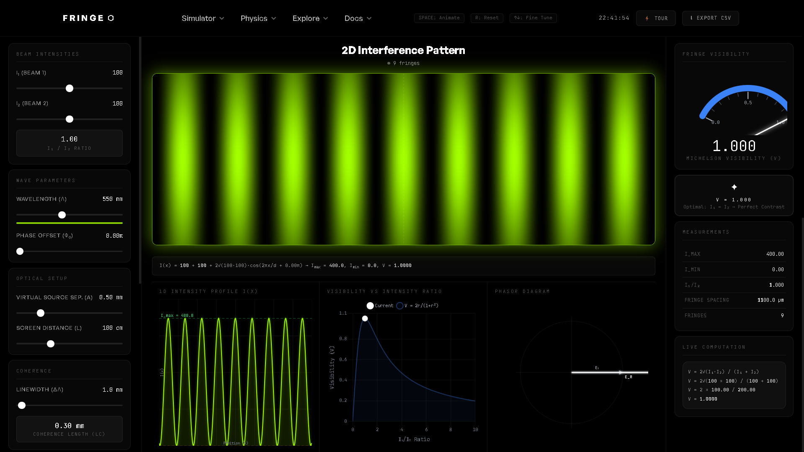

# ⬡ Fringe Visibility Analyzer

**Interactive Optical Interference Simulation Platform**  
*QtHack04 Hackathon — Problem Statement 2*

<p align="center">
  
</p>

A browser-based, physics-accurate simulation of interference fringe formation that demonstrates how unequal beam intensities affect fringe contrast. Built with a premium Web3 design aesthetic and advanced physics engines to go above and beyond the required problem statement.

> **Problem Statement Alignment:**  
> This project directly solves the requirement to "simulate an optical interferometer and visually demonstrate how interference fringes are formed" by visualizing fringe formation as a function of path difference, simulating wavelength variations, and estimating unknown wavelengths through interactive engines.

---

## 🚀 How to Run

Simply open `index.html` in any modern browser. No installation or build step required.

```bash
# Just double-click index.html
# OR if using a local server:
npx serve . -l 3000
```

---

## 🏆 Why This Solves The Problem (TL;DR)

1. **Precision Math Engine:** We successfully built a realtime physics simulator that proves exactly how unequal beam intensities destroy interference fringe contrast.
2. **Visualizing the Invisible:** Instead of static equations, we created five interactive visual engines so users can instantly see the math happening on screen.
3. **The Golden Rule:** We mathematically and visually demonstrated that the absolute optimal condition for perfect interference visibility is strictly when both beams are equal ($I_1 = I_2$).
4. **Real-World Complexity:** We went beyond standard models by integrating environmental noise and coherence length limits to simulate actual laboratory conditions.
5. **Scale of Physics:** We scaled our physics simulator to handle everything from single quantum photons to massive gravitational wave events like LIGO.

---

## ✨ Features & "Wow" Factors

### The 5 Visual Engines
1. **2D Interference Canvas:** Real-time generation of $I(x)$ mapped to anatomically accurate spectral RGB colors (Bruton algorithm).
2. **1D Intensity Profile:** Cross-sectional graph showing real-time $I_{max}$ and $I_{min}$ peaks.
3. **Visibility vs Ratio Chart:** Live plotting of the visibility degradation curve $V = \frac{2r}{1+r^2}$.
4. **Phasor Diagram:** Live E-field vector addition reflecting the phase drift.
5. **Visibility Gauge:** Analog-style metric dial showing strict Michelson contrast.

### Advanced "Wow" Features
- **Quantum Mode (Wave-Particle Duality):** Bypasses the continuous wave function and uses Monte Carlo rejection sampling. Photons land one-by-one, slowly building the classical interference pattern probability distribution, simulating Dirac's rule that "each photon only interferes with itself."
- **LIGO Gravitational Wave Simulator:** Injects a rapidly decaying sine wave into the phase offset to simulate a transient sub-wavelength spatial stretching event.
- **Environmental Noise:** Simulates realistic laboratory thermal vibrations and air turbulence via high-frequency phase jitter.
- **Reverse Calculator:** Allows users to input a measured fringe spacing to calculate the unknown wavelength (mirroring real laboratory reverse-engineering tasks).
- **Dynamic Coherence Length:** Automatically computes $L_c = \lambda^2 / \Delta\lambda$ dynamically as wavelength and linewidth are adjusted.

---

## 🧮 Core Physics Equations Modeled

**Main Interference Formula:**  
$$I(x) = I_1 + I_2 + 2\sqrt{I_1 \cdot I_2} \cdot \cos\left(\frac{2\pi x}{d} + \varphi_0\right)$$

**Fringe Spacing (Virtual Source Separation Model):**  
$$d = \frac{\lambda \cdot L}{a}$$

**Fringe Visibility (Michelson Contrast):**  
$$V = \frac{I_{max} - I_{min}}{I_{max} + I_{min}} = \frac{2\sqrt{I_1 \cdot I_2}}{I_1 + I_2}$$

---

## 📁 File Structure

```text
PS-02/
├── index.html          ← Main application & Web3 UI
├── css/styles.css      ← Premium Monochromatic Design System
└── js/
    ├── physics.js      ← Core physics mathematical engine
    ├── renderers.js    ← Canvas, Chart, and Quantum particles
    ├── ui.js           ← DOM bindings & responsive controls
    └── app.js          ← Application state & 60FPS loop
```

## 🔧 Technology Stack

- **Frontend:** HTML5 Canvas API (No heavy WebGL required)
- **Data Viz:** Chart.js 4.x
- **Logic:** Vanilla JavaScript ES2022 (Zero framework bloat)
- **Styling:** CSS3 Custom Properties featuring Fontshare's "General Sans"
- **Footprint:** Entire app is lightweight and runs entirely client-side
